# PrismaInmobiliaria

> Plataforma web inmobiliaria full-stack (MERN) para publicar, buscar, comprar y alquilar propiedades.

[](https://nodejs.org/)
[](https://expressjs.com/)
[](https://www.mongodb.com/)
[](https://react.dev/)
[](https://vitejs.dev/)
[](https://redux-toolkit.js.org/)
[](https://firebase.google.com/)
[](https://tailwindcss.com/)

---

## Tabla de contenidos

1. [Descripción del proyecto](#1-descripción-del-proyecto)
2. [Características principales](#2-características-principales)
3. [Stack tecnológico](#3-stack-tecnológico)
4. [Arquitectura del sistema](#4-arquitectura-del-sistema)
5. [Diagramas UML](#5-diagramas-uml)
6. [Modelo de datos](#6-modelo-de-datos)
7. [Estructura del repositorio](#7-estructura-del-repositorio)
8. [Flujo de autenticación](#8-flujo-de-autenticación)
9. [API REST](#9-api-rest)
10. [Frontend](#10-frontend)
11. [Gestión de imágenes](#11-gestión-de-imágenes)
12. [Búsqueda y filtrado](#12-búsqueda-y-filtrado)
13. [Instalación y configuración](#13-instalación-y-configuración)
14. [Scripts disponibles](#14-scripts-disponibles)
15. [Variables de entorno](#15-variables-de-entorno)
16. [Flujo de desarrollo](#16-flujo-de-desarrollo)
17. [Seguridad](#17-seguridad)
18. [Roadmap y consideraciones](#18-roadmap-y-consideraciones)

---

## 1. Descripción del proyecto

**PrismaInmobiliaria** es una aplicación web de tipo marketplace inmobiliario construida con el stack **MERN** (MongoDB, Express, React, Node.js). Permite a los usuarios registrarse, autenticarse (email/contraseña o Google), publicar anuncios de propiedades en venta o alquiler, gestionar su perfil y contactar a propietarios mediante correo electrónico.

| Aspecto | Detalle |
|--------|---------|
| **Nombre de producto** | PrismaInmobiliaria |
| **Tipo** | SPA + API REST |
| **Idioma de la UI** | Español |
| **Arquitectura** | Cliente-servidor desacoplado con proxy de desarrollo |
| **Persistencia** | MongoDB (documentos) + localStorage (sesión Redux) |
| **Almacenamiento de archivos** | Firebase Storage (URLs en MongoDB) |

El repositorio no es un monorepo formal con workspaces: el **backend** vive en la raíz (`api/`) y el **frontend** es un paquete npm independiente en `client/`.

---

## 2. Características principales

| Módulo | Capacidad |
|--------|-----------|
| **Autenticación** | Registro, inicio de sesión, OAuth con Google (Firebase), cierre de sesión |
| **Perfil** | Actualizar usuario, avatar, eliminar cuenta, ver listados propios |
| **CRUD de listados** | Crear, editar, eliminar y consultar propiedades |
| **Búsqueda avanzada** | Texto, tipo (venta/alquiler), oferta, parking, amueblado, ordenación y paginación |
| **Home** | Carrusel de ofertas + secciones de venta y alquiler recientes |
| **Contacto** | Composición de `mailto:` hacia el propietario del anuncio |
| **Rutas privadas** | Protección de perfil, creación/edición de listados y detalle de listing |
| **Estado global** | Redux Toolkit + `redux-persist` |

---

## 3. Stack tecnológico

### 3.1 Vista general

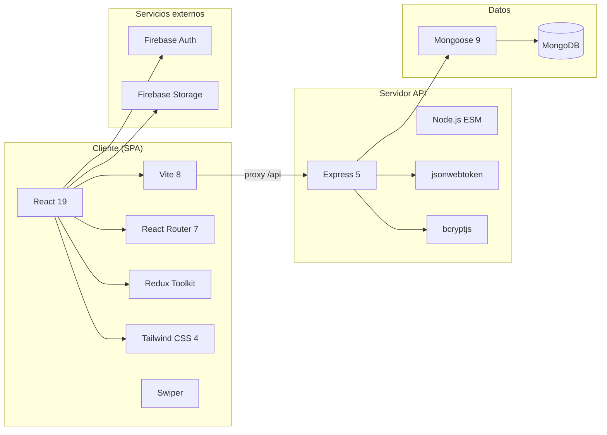

### 3.2 Backend

| Tecnología | Versión / uso | Rol |
|------------|---------------|-----|
| **Node.js** | ESM (`"type": "module"`) | Runtime |
| **Express** | 5.x | Framework HTTP / routing |
| **MongoDB** | Driver 7.x | Base de datos NoSQL |
| **Mongoose** | 9.x | ODM, esquemas y validación |
| **jsonwebtoken** | 9.x | Emisión y verificación de JWT |
| **bcryptjs** | 3.x | Hash de contraseñas |
| **cookie-parser** | 1.x | Lectura de cookies HTTP |
| **dotenv** | 17.x | Variables de entorno |
| **nodemon** | 3.x (dev) | Recarga en caliente del API |

### 3.3 Frontend

| Tecnología | Versión / uso | Rol |
|------------|---------------|-----|
| **React** | 19.x | UI declarativa |
| **Vite** | 8.x | Bundler y dev server |
| **React Router DOM** | 7.x | Enrutamiento SPA |
| **Redux Toolkit** | 2.x | Estado global de usuario |
| **redux-persist** | 6.x | Persistencia en `localStorage` |
| **Tailwind CSS** | 4.x (`@tailwindcss/vite`) | Estilos utilitarios |
| **Firebase** | 12.x | Google Auth + Storage |
| **Swiper** | 14.x | Carrusel en Home |
| **lucide-react** | Iconografía | UI |
| **React Compiler** | Babel plugin | Optimización de re-renders |

### 3.4 Infraestructura de desarrollo

| Pieza | Configuración |
|-------|----------------|
| API | `http://localhost:3000` |
| Cliente Vite | `http://localhost:5173` (por defecto) |
| Proxy | `/api` → `http://localhost:3000` (`client/vite.config.js`) |
| Cookie de sesión | `access_token` (httpOnly) |

---

## 4. Arquitectura del sistema

### 4.1 Diagrama de arquitectura en capas

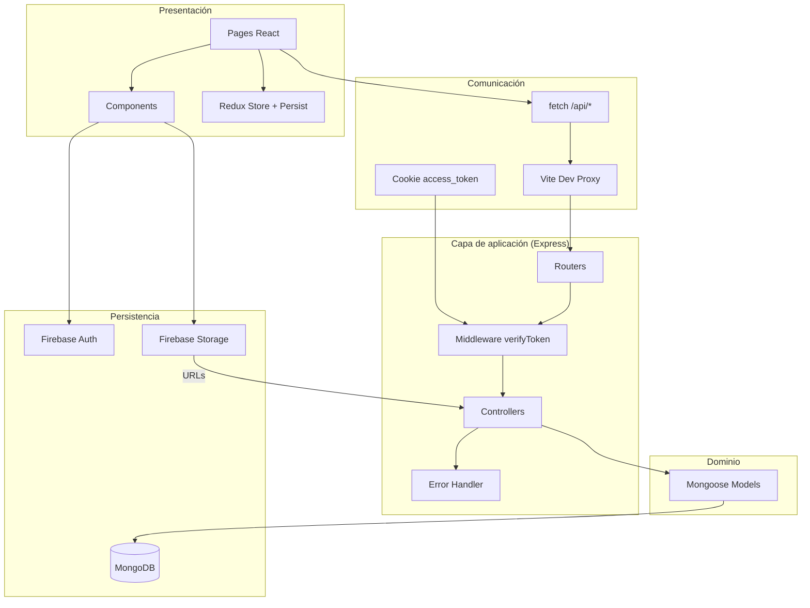

### 4.2 Diagrama de componentes

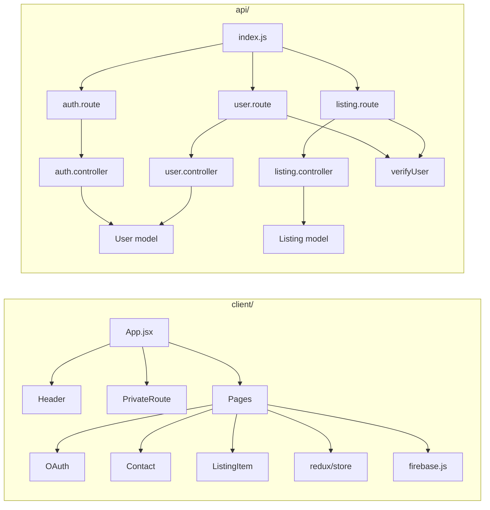

### 4.3 Patrón de diseño

La API sigue una separación clásica **Router → Controller → Model**:

1. **Router** — define método HTTP, path y middleware.
2. **Controller** — orquesta la lógica de negocio y responde JSON.
3. **Model** — valida y persiste en MongoDB vía Mongoose.
4. **Utils** — `verifyUser` (JWT) y `errorHandler` (errores tipados).

El frontend sigue **páginas + componentes presentacionales**, con estado de usuario centralizado en Redux y estado local (`useState`) para listados y formularios.

---

## 5. Diagramas UML

### 5.1 Diagrama de casos de uso

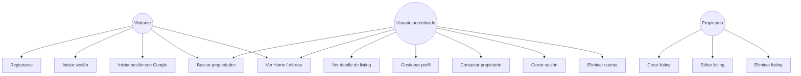

> **Nota de implementación:** la ruta `/listing/:listingId` está protegida por `PrivateRoute`. Un visitante puede buscar en Home/Search, pero al abrir el detalle se le redirige a `/sign-in` si no hay sesión.

### 5.2 Diagrama de clases (dominio)

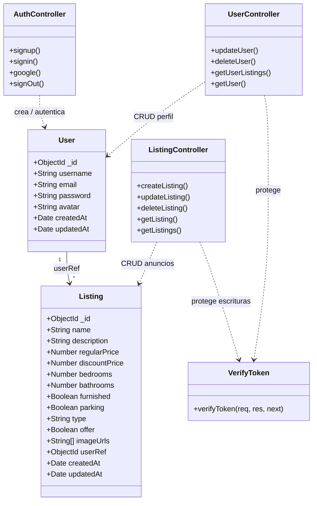

### 5.3 Diagrama de secuencia — Login con email

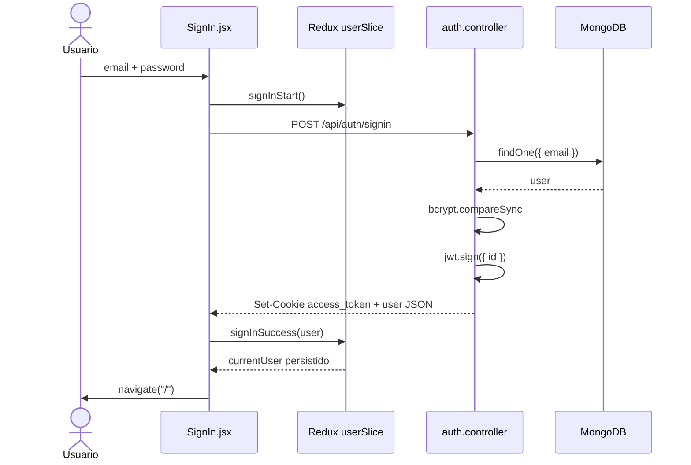

### 5.4 Diagrama de secuencia — OAuth Google

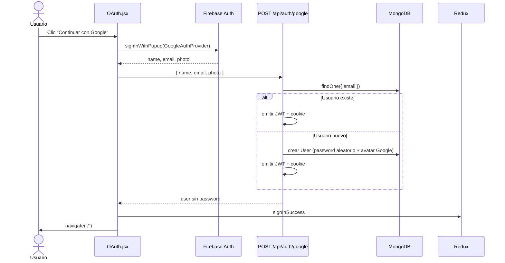

### 5.5 Diagrama de secuencia — Crear listing con imágenes

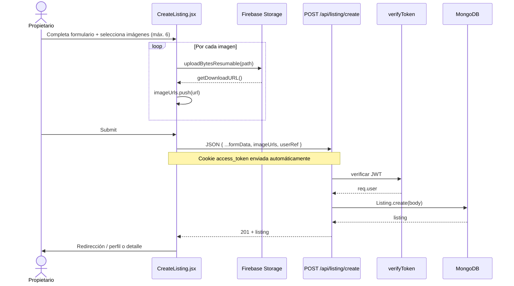

### 5.6 Diagrama de estados — Sesión de usuario (Redux)

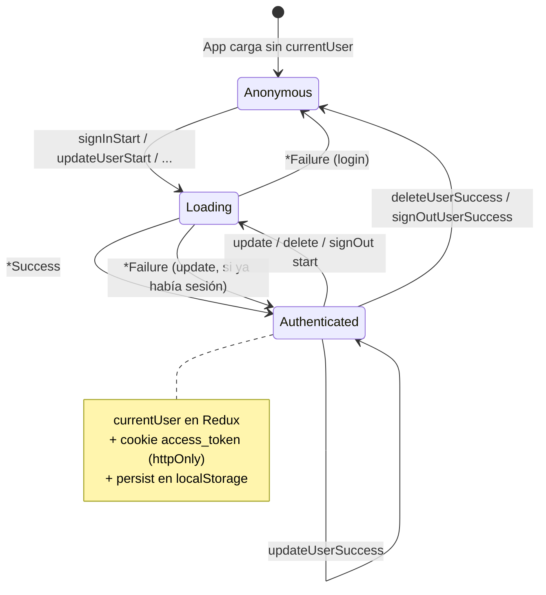

### 5.7 Diagrama de actividad — Búsqueda

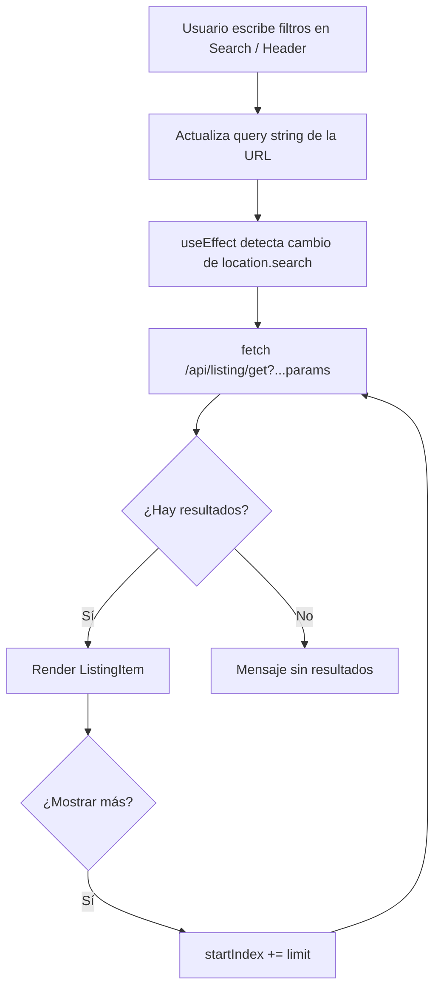

---

## 6. Modelo de datos

### 6.1 Diagrama entidad-relación (lógico)

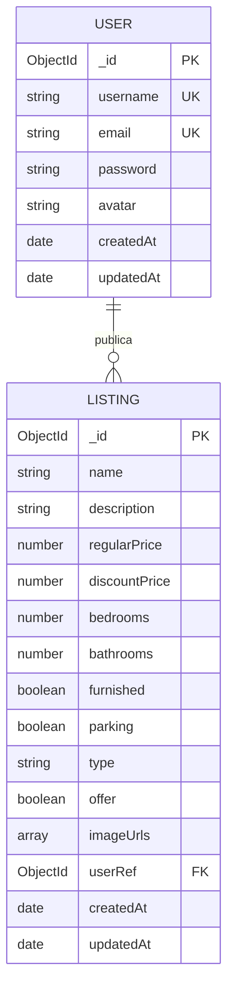

### 6.2 Colección `users`

| Campo | Tipo | Restricciones | Descripción |
|-------|------|---------------|-------------|
| `_id` | ObjectId | PK | Identificador MongoDB |
| `username` | String | required, unique | Nombre de usuario |
| `email` | String | required, unique | Correo de acceso |
| `password` | String | required | Hash bcrypt (cost 10) |
| `avatar` | String | default URL Pixabay | Foto de perfil |
| `createdAt` / `updatedAt` | Date | timestamps | Auditoría automática |

### 6.3 Colección `listings`

| Campo | Tipo | Restricciones | Descripción |
|-------|------|---------------|-------------|
| `_id` | ObjectId | PK | Identificador |
| `name` | String | required | Título del anuncio |
| `description` | String | required | Descripción |
| `regularPrice` | Number | required | Precio regular |
| `discountPrice` | Number | required | Precio con oferta |
| `bedrooms` | Number | required | Habitaciones |
| `bathrooms` | Number | required | Baños |
| `furnished` | Boolean | required | Amueblado |
| `parking` | Boolean | required | Estacionamiento |
| `type` | String | required | `"sale"` \| `"rent"` |
| `offer` | Boolean | required | Tiene oferta activa |
| `imageUrls` | Array | required | URLs de Firebase Storage |
| `userRef` | ObjectId | required, ref `User` | Propietario |
| `createdAt` / `updatedAt` | Date | timestamps | Auditoría |

> El formulario de creación/edición en el cliente puede enviar un campo `address`. Si no está definido en el esquema Mongoose (modo `strict` por defecto), **no se persistirá** hasta añadirlo al modelo.

---

## 7. Estructura del repositorio

```text
MernState/
├── .env                          # MONGO_URI, JWT_SECRET (gitignored)
├── .gitignore
├── package.json                  # Dependencias y scripts del API
├── package-lock.json
├── README.md                     # Esta documentación
│
├── api/                          # Backend Express
│   ├── index.js                  # Bootstrap: Mongo, middleware, rutas, puerto 3000
│   ├── controllers/
│   │   ├── auth.controller.js    # signup, signin, google, signOut
│   │   ├── user.controller.js    # update, delete, listings, getUser
│   │   └── listing.controller.js # CRUD + búsqueda
│   ├── models/
│   │   ├── user.model.js
│   │   └── listing.model.js
│   ├── routes/
│   │   ├── auth.route.js
│   │   ├── user.route.js
│   │   └── listing.route.js
│   └── utils/
│       ├── error.js              # errorHandler(status, message)
│       └── verifyUser.js         # Middleware JWT desde cookie
│
└── client/                       # Frontend React + Vite
    ├── .env                      # VITE_FIREBASE_API_KEY
    ├── index.html
    ├── package.json
    ├── vite.config.js            # Proxy /api → :3000
    ├── public/
    └── src/
        ├── main.jsx              # Provider + PersistGate
        ├── App.jsx               # Definición de rutas
        ├── index.css             # Tailwind + tipografía
        ├── firebase.js           # Inicialización Firebase
        ├── pages/
        │   ├── Home.jsx
        │   ├── About.jsx
        │   ├── SignIn.jsx
        │   ├── SignUp.jsx
        │   ├── Profile.jsx
        │   ├── CreateListing.jsx
        │   ├── UpdateListing.jsx
        │   ├── Listing.jsx
        │   └── Search.jsx
        ├── components/
        │   ├── Header.jsx
        │   ├── PrivateRoute.jsx
        │   ├── OAuth.jsx
        │   ├── Contact.jsx
        │   └── ListingItem.jsx
        └── redux/
            ├── store.js
            └── user/userSlice.js
```

---

## 8. Flujo de autenticación

### 8.1 Canales soportados

| Canal | Entrada | Persistencia de sesión |
|-------|---------|------------------------|
| Email / contraseña | `POST /api/auth/signin` | Cookie `access_token` + Redux |
| Registro | `POST /api/auth/signup` | Solo crea usuario (no inicia sesión) |
| Google OAuth | Firebase popup → `POST /api/auth/google` | Cookie + Redux |
| Cierre | `GET /api/auth/signout` | Limpia cookie + Redux |

### 8.2 Emisión del token

```text
jwt.sign({ id: user._id }, process.env.JWT_SECRET)
→ res.cookie('access_token', token, { httpOnly: true })
```

- El payload contiene únicamente el `id` del usuario.
- `httpOnly: true` impide acceso desde JavaScript del navegador (mitiga XSS sobre el token).
- El cliente guarda el **objeto usuario** (sin password) en Redux Persist para la UI.

### 8.3 Middleware `verifyToken`

Ubicación: `api/utils/verifyUser.js`.

1. Lee `req.cookies.access_token`.
2. Si no existe → `401` *No autorizado*.
3. Si es inválido → `403` vía `errorHandler`.
4. Si es válido → adjunta `req.user` y continúa.

Las operaciones sensibles (actualizar/eliminar usuario, CRUD de escritura de listings, obtener listings del usuario, obtener datos de otro usuario para contacto) pasan por este middleware. Además, los controllers de listing/usuario verifican que `req.user.id` coincida con el dueño del recurso.

### 8.4 Rutas privadas en el cliente

```jsx
// App.jsx (simplificado)
<Route element={<PrivateRoute />}>
  <Route path="/profile" element={<Profile />} />
  <Route path="/create-listing" element={<CreateListing />} />
  <Route path="/update-listing/:listingId" element={<UpdateListing />} />
  <Route path="/listing/:listingId" element={<Listing />} />
</Route>
```

`PrivateRoute` consulta `state.user.currentUser`. Si hay sesión renderiza `<Outlet />`; si no, redirige a `/sign-in`.

---

## 9. API REST

**Base URL (desarrollo):** `http://localhost:3000`  
**Desde el cliente Vite:** rutas relativas `/api/...` (proxy).

### 9.1 Autenticación — `/api/auth`

| Método | Endpoint | Auth | Descripción |
|--------|----------|------|-------------|
| `POST` | `/api/auth/signup` | No | Crea usuario (password hasheado) |
| `POST` | `/api/auth/signin` | No | Login; setea cookie JWT |
| `POST` | `/api/auth/google` | No | Login/registro vía Google |
| `GET` | `/api/auth/signout` | No | Limpia cookie |

**Ejemplo — signup**

```http
POST /api/auth/signup
Content-Type: application/json

{
  "username": "ana_garcia",
  "email": "ana@email.com",
  "password": "secreto123"
}
```

**Ejemplo — signin (respuesta)**

```json
{
  "_id": "...",
  "username": "ana_garcia",
  "email": "ana@email.com",
  "avatar": "https://...",
  "createdAt": "...",
  "updatedAt": "..."
}
```

Header de respuesta: `Set-Cookie: access_token=...; HttpOnly`

### 9.2 Usuarios — `/api/user`

| Método | Endpoint | Auth | Descripción |
|--------|----------|------|-------------|
| `GET` | `/api/user/test` | No | Ping de prueba |
| `POST` | `/api/user/update/:id` | JWT + dueño | Actualiza perfil |
| `DELETE` | `/api/user/delete/:id` | JWT + dueño | Elimina cuenta |
| `GET` | `/api/user/listings/:id` | JWT + dueño | Listados del usuario |
| `GET` | `/api/user/:id` | JWT | Datos públicos del usuario (contacto) |

### 9.3 Listados — `/api/listing`

| Método | Endpoint | Auth | Descripción |
|--------|----------|------|-------------|
| `POST` | `/api/listing/create` | JWT | Crea anuncio |
| `PUT` | `/api/listing/update/:id` | JWT + dueño | Actualiza anuncio |
| `DELETE` | `/api/listing/delete/:id` | JWT + dueño | Elimina anuncio |
| `GET` | `/api/listing/get/:id` | No | Detalle por ID |
| `GET` | `/api/listing/get` | No | Listado filtrado |

### 9.4 Query params de búsqueda (`GET /api/listing/get`)

| Parámetro | Default | Descripción |
|-----------|---------|-------------|
| `limit` | `9` | Tamaño de página |
| `startIndex` | `0` | Offset (paginación) |
| `offer` | ambos | `true` filtra solo ofertas |
| `furnished` | ambos | `true` solo amueblados |
| `parking` | ambos | `true` solo con parking |
| `type` | `all` | `all` \| `sale` \| `rent` |
| `searchTerm` | `""` | Regex case-insensitive sobre `name` |
| `sort` | `createdAt` | Campo de ordenación |
| `order` | `desc` | `asc` \| `desc` |

**Ejemplo**

```http
GET /api/listing/get?searchTerm=casa&type=rent&parking=true&sort=regularPrice&order=asc&limit=9&startIndex=0
```

### 9.5 Manejo de errores

Middleware central en `api/index.js`:

```json
{
  "success": false,
  "statusCode": 401,
  "message": "Credenciales incorrectas"
}
```

Los controllers invocan `next(error)` o `next(errorHandler(code, message))`.

### 9.6 Endpoint de salud

| Método | Endpoint | Respuesta |
|--------|----------|-----------|
| `GET` | `/test` | `{ "message": "Hello World" }` |

---

## 10. Frontend

### 10.1 Mapa de rutas

| Ruta | Página | Pública | Descripción |
|------|--------|---------|-------------|
| `/` | `Home` | Sí | Hero, swiper de ofertas, grids |
| `/about` | `About` | Sí | Información de la marca |
| `/sign-in` | `SignIn` | Sí | Login + OAuth Google |
| `/sign-up` | `SignUp` | Sí | Registro |
| `/search` | `Search` | Sí | Filtros + resultados paginados |
| `/profile` | `Profile` | No | Perfil, avatar, mis listings |
| `/create-listing` | `CreateListing` | No | Nuevo anuncio |
| `/update-listing/:listingId` | `UpdateListing` | No | Editar anuncio |
| `/listing/:listingId` | `Listing` | No* | Detalle + contacto + compartir |

\*Protegida en el cliente por `PrivateRoute` (la API `GET /get/:id` es pública).

### 10.2 Componentes clave

| Componente | Responsabilidad |
|------------|-----------------|
| `Header` | Navegación, búsqueda rápida, avatar / links de auth |
| `PrivateRoute` | Guard de sesión Redux |
| `OAuth` | Popup Google + sync con API |
| `ListingItem` | Tarjeta de propiedad (imagen, precio, amenities) |
| `Contact` | Carga landlord y arma `mailto:` |

### 10.3 Estado global (Redux)

```text
store
└── user
    ├── currentUser   // objeto usuario o null
    ├── loading       // boolean
    └── error         // string | null
```

**Acciones del `userSlice`:**

- `signInStart` / `signInSuccess` / `signInFailure`
- `updateUserStart` / `updateUserSuccess` / `updateUserFailure`
- `deleteUserStart` / `deleteUserSuccess` / `deleteUserFailure`
- `signOutUserStart` / `signOutUserSuccess` / `signOutUserFailure`

Persistencia:

```js
persistConfig = { key: 'root', storage: localStorage, version: 1 }
```

Los listados **no** viven en Redux: cada página los obtiene con `fetch` y `useState`.

### 10.4 Bootstrap de la app

```text
main.jsx
  └── <Provider store>
        └── <PersistGate>
              └── <App />  → BrowserRouter + Header + Routes
```

---

## 11. Gestión de imágenes

Las imágenes **no** pasan por el servidor Express. El flujo es 100 % cliente → Firebase Storage → URL → MongoDB.

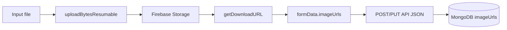

| Aspecto | Detalle |
|---------|---------|
| Servicio | Firebase Storage (`storageBucket` del proyecto) |
| Path típico | `` `${Date.now()}${file.name}` `` |
| Límite UI | Hasta **6** imágenes por listing |
| Tamaño | Orientado a **&lt; 2 MB** por archivo (reglas Storage) |
| Avatar | Mismo mecanismo; se guarda en `user.avatar` |
| API | Solo recibe strings URL; no hay `multipart/form-data` |

---

## 12. Búsqueda y filtrado

1. El **Header** escribe `?searchTerm=` y navega a `/search`.
2. **Search.jsx** mantiene un estado de filtros sincronizado con la URL.
3. Al cambiar la query, se llama a `GET /api/listing/get` con los parámetros.
4. El backend construye un filtro MongoDB:
   - `name: { $regex: searchTerm, $options: 'i' }`
   - booleanos con `$in: [true, false]` cuando el filtro no está activo
   - `type` con `$in: ['sale','rent']` cuando es `all`
5. Ordenación dinámica: `.sort({ [sort]: order })`.
6. Paginación por `limit` + `skip(startIndex)` y botón “Show more” en el cliente.

El **Home** hace tres peticiones acotadas (`limit=4`):

- Ofertas: `?offer=true`
- Alquiler: `?type=rent`
- Venta: `?type=sale`

---

## 13. Instalación y configuración

### 13.1 Requisitos previos

- **Node.js** 18+ (recomendado LTS)
- **npm** 9+
- Cuenta **MongoDB Atlas** (o MongoDB local)
- Proyecto **Firebase** con Authentication (Google) y Storage habilitados

### 13.2 Clonar e instalar

```bash
git clone https://github.com/Riscanevo/MercadoInmoviliario_MERN.git
cd MercadoInmoviliario_MERN   # o MernState según el nombre local

# Dependencias del API (raíz)
npm install

# Dependencias del cliente
cd client
npm install
cd ..
```

### 13.3 Variables de entorno

**Raíz — `.env`**

```env
MONGO_URI=mongodb+srv://<usuario>:<password>@<cluster>/<db>
JWT_SECRET=<cadena_secreta_larga_y_aleatoria>
```

**Cliente — `client/.env`**

```env
VITE_FIREBASE_API_KEY=<tu_api_key_de_firebase>
```

El resto de la config Firebase (`authDomain`, `projectId`, `storageBucket`, etc.) está en `client/src/firebase.js`.

### 13.4 Firebase (checklist)

1. Crear proyecto en [Firebase Console](https://console.firebase.google.com/).
2. Habilitar **Authentication → Google**.
3. Crear bucket de **Storage** y reglas de lectura/escritura (p. ej. imágenes &lt; 2 MB).
4. Copiar `apiKey` a `VITE_FIREBASE_API_KEY`.
5. Autorizar el dominio local (`localhost`) en Authentication.

### 13.5 Arranque en desarrollo

Terminal 1 — API:

```bash
npm run dev
# → Server is running on port 3000!
# → Connected to MongoDB
```

Terminal 2 — Cliente:

```bash
cd client
npm run dev
# → http://localhost:5173
```

Abrir el navegador en la URL de Vite. Las llamadas a `/api/*` se reenvían al puerto 3000.

---

## 14. Scripts disponibles

### Raíz (`package.json`)

| Script | Comando | Uso |
|--------|---------|-----|
| `npm run dev` | `nodemon api/index.js` | API en modo desarrollo |
| `npm start` | `node api/index.js` | API en producción |

### Cliente (`client/package.json`)

| Script | Comando | Uso |
|--------|---------|-----|
| `npm run dev` | `vite` | Dev server + HMR |
| `npm run build` | `vite build` | Build a `client/dist` |
| `npm run preview` | `vite preview` | Previsualizar build |
| `npm run lint` | `eslint .` | Análisis estático |

---

## 15. Variables de entorno

| Variable | Ubicación | Obligatoria | Descripción |
|----------|-----------|-------------|-------------|
| `MONGO_URI` | raíz `.env` | Sí | Cadena de conexión MongoDB |
| `JWT_SECRET` | raíz `.env` | Sí | Secreto para firmar/verificar JWT |
| `VITE_FIREBASE_API_KEY` | `client/.env` | Sí | API key pública de Firebase |

> Prefijo `VITE_`: Vite solo expone al cliente variables que empiezan por `VITE_`. Nunca coloques secretos de servidor en el frontend.

---

## 16. Flujo de desarrollo

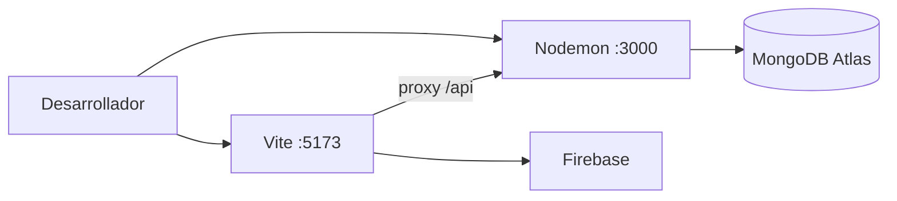

1. Cambios en `api/` → Nodemon reinicia el servidor.
2. Cambios en `client/src/` → HMR de Vite.
3. Autenticación y cookies se prueban en el mismo origen efectivo gracias al proxy (evita problemas de CORS en desarrollo).
4. Para producción: construir el cliente (`npm run build`), servir `dist` estáticamente y apuntar el API a un host con HTTPS (cookies seguras, CORS explícito si hay dominios separados).

---

## 17. Seguridad

| Medida | Implementación |
|--------|----------------|
| Contraseñas | Hash con `bcryptjs` (salt rounds = 10) |
| Sesión | JWT en cookie `httpOnly` |
| Autorización | Middleware JWT + comprobación de ownership |
| Exposición de password | Destructuración `{ password, ...rest }` antes de responder |
| XSS sobre token | Mitigado por `httpOnly` (el token no es accesible vía `document.cookie`) |
| Uploads | Fuera del API; reglas de Firebase Storage |

**Buenas prácticas recomendadas para endurecer producción:**

- `secure: true` y `sameSite: 'strict'` / `'lax'` en cookies bajo HTTPS
- Rate limiting en `/api/auth/*`
- Validación de entrada (Joi / Zod) en controllers
- CORS configurado explícitamente
- Rotación de `JWT_SECRET` y expiración en el JWT (`expiresIn`)

---

## 18. Roadmap y consideraciones

### Estado actual documentado

- API y SPA funcionales para el ciclo inmobiliario básico.
- Auth dual (local + Google).
- Búsqueda con filtros y Home con secciones segmentadas.

### Mejoras sugeridas

| Área | Sugerencia |
|------|------------|
| Modelo | Añadir `address` (y opcionalmente `geo`) al schema de Listing |
| UX | Hacer público el detalle `/listing/:id` si se desea browsing sin login |
| API | Eliminar el montaje duplicado de `listingRouter` en `api/index.js` |
| Auth | Expiración de JWT + refresh tokens |
| Deploy | Dockerfile / Compose, CI, hosting (Render, Railway, Vercel + Atlas) |
| Calidad | Tests (Jest/Vitest + Supertest), tipado TypeScript |
| Producto | Favoritos, mapas, chat in-app, paneles de analytics |

---

## Licencia y autoría

- **Proyecto:** PrismaInmobiliaria / MernState  
- **Repositorio:** [MercadoInmoviliario_MERN](https://github.com/Riscanevo/MercadoInmoviliario_MERN)  
- **Licencia:** ISC (según `package.json` raíz)

---

## Resumen

PrismaInmobiliaria es una aplicación MERN donde React (Vite) consume una API Express autenticada por JWT en cookies, persiste usuarios y anuncios en MongoDB, y delega autenticación social y almacenamiento de imágenes a Firebase. La arquitectura está desacoplada en capas claras (rutas → controladores → modelos), con un frontend orientado a páginas protegidas, búsqueda por query string y estado de sesión gestionado con Redux Persist.

Para contribuir: levanta API y cliente en paralelo, configura `.env` y Firebase, y usa los diagramas de esta guía como mapa de navegación del sistema.
